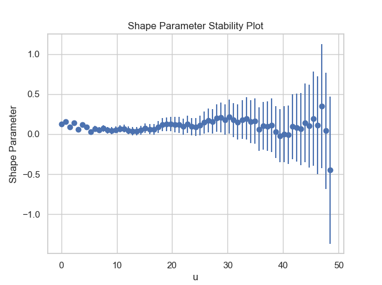
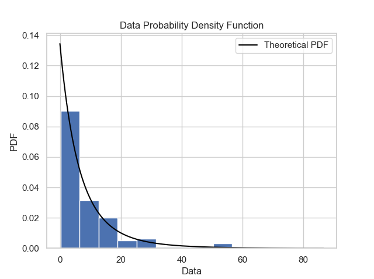
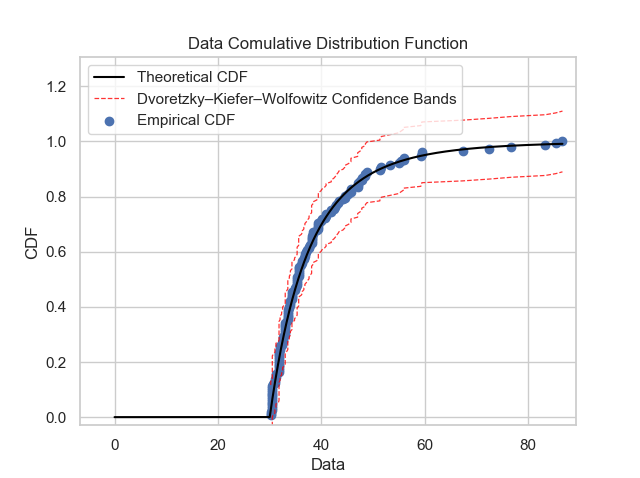
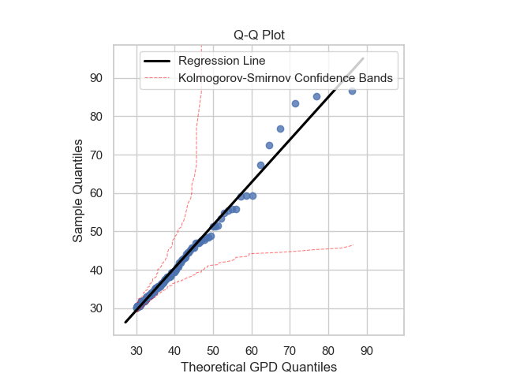
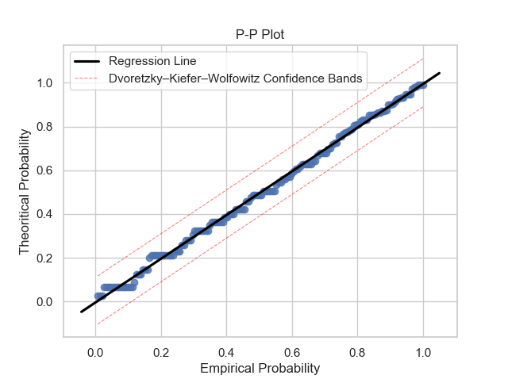

# thresholdmodeling: A Python package for modeling excesses over a threshold using the Peak-Over-Threshold Method and the Generalized Pareto Distribution

This package is intended for those who wish to conduct an extreme values analysis. It provides the whole toolkit necessary to create a threshold model in a simple and efficient way, presenting the main methods towards the Peak-Over-Threshold method and the fit in the Generalized Pareto Distribution.

In this repository you can find the main files of the package, the [Functions Documenation](https://github.com/iagolemos1/thresholdmodeling/blob/master/Functions%20Documentation.md), the [dataset](https://github.com/iagolemos1/thresholdmodeling/blob/master/dataset/rain.csv) used in some examples, the [paper](https://github.com/iagolemos1/thresholdmodeling/blob/master/paper.md) submitted to the [Jounal of Open Source Software](https://joss.theoj.org/) and some tutorials. 

# Installing Package 
**It is necessary to have internet connection.**
For installing the package just use the following command (it is already in PyPi): 
```
pip install thresholdmodeling
```
The Python dependencies for runing the software will install automatically with this command.

Once the package is installed, it is necessary to run this lines on your IDE for installing ``POT`` package:
```python
from rpy2.robjects.packages import importr
import rpy2.robjects.packages as rpackages

base = importr('base')
utils = importr('utils')
utils.chooseCRANmirror(ind=1)
utils.install_packages('POT') #installing POT package
```
Or, it is possible to download this [file](https://github.com/iagolemos1/thresholdmodeling/blob/master/install_pot.py) in order to run it in yout IDE and installing ``POT``.

# User's guide and Reproducibility 
In the file [test](https://github.com/iagolemos1/thresholdmodeling/blob/master/Test/test.py) it is possible to see how the package should be used. In [Functions Documenation](https://github.com/iagolemos1/thresholdmodeling/blob/master/Functions%20Documentation.md) it may be seen a complete documentation on how to use the functions presented in the package. 

In order to present a tutorial on how to use the package and its results, a guide is presented below, using the example on the Coles's [book](https://www.springer.com/gp/book/9781852334598) with the [Daily Rainfall in South-West England](https://github.com/iagolemos1/thresholdmodeling/blob/master/dataset/rain.csv) dataset.

## Threshold Selection
Firstly, it is necessary to conduct a threshold value analysis using the first two functions of the package: ``MRL`` and ``Parameter_Stability_Plot``, in order to select a reasonable threshold value. 
Runing this: 
```python
from thresholdmodeling import thresh_modeling #importing package
import pandas as pd #importing pandas

url = 'https://raw.githubusercontent.com/iagolemos1/thresholdmodeling/master/dataset/rain.csv' #saving url
df =  pd.read_csv(url, error_bad_lines=False) #getting data
data = df.values.ravel() #turning data into an array

thresh_modeling.MRL(data, 0.05)   
thresh_modeling.Parameter_Stability_plot(data, 0.05)
```
The results must be:





Then, by analysing the three graphics, it is reasonable taking the threshold value as 30.

## Model Fit
Once the threshold value is defined, it is possible to fit the dataset to a GPD model by using the function ``gpdfit``running the following line and using the maximum likelihood estimation method:

```python
thresh_modeling.gpdfit(data, 30, 'mle')
```

The results must be in Terminal like:
```
Estimator: MLE

 Deviance: 970.1874

      AIC: 974.1874


Varying Threshold: FALSE


  Threshold Call: 30L

    Number Above: 152

Proportion Above: 0.0087


Estimates

 scale   shape

7.4411  0.1845


Standard Error Type: observed


Standard Errors

 scale   shape

0.9587  0.1012


Asymptotic Variance Covariance

       scale     shape

scale   0.91920  -0.06554

shape  -0.06554   0.01025


Optimization Information

  Convergence: successful

  Function Evaluations: 14

  Gradient Evaluations: 6
```
These are the GPD model estimatives using the maximum likelihood estimator.

## Model Checking
Once the GPD model is defined, it is necessary to verify if the model is reasonable and describes well the empirical observations. Plots like probability density function, comulative distribution function, quantile-quantile and probability-probability can show to us if the model is good. It is possible using some functions of the package: ``gpdpdf``, ``gpdcdf``, ``qqplot`` and ``ppplot``. By running these lines:
```python
thresh_modeling.gpdpdf(data, 30, 'mle', 'sturges', 0.05)
thresh_modeling.gpdcdf(data, 30, 'mle', 0.05)
thresh_modeling.qqplot(data,30, 'mle', 0.05)
thresh_modeling.ppplot(data, 30, 'mle', 0.05)
```
The results must be:









Once it is possible to verifiy that the theoretical model describes very well the empirical observations, the next step it to use the main tool of the extreme values approach: extrapolation over the unit of the return period.

## Return Value Analysis
The first thing that must be defined is: what is the unit of the return period? In this example, the unit is days because the observations are **daily**, but in other applications, like corrosion engineering, the unit may be number of observations. 

Using the function ``return_value`` is possible to get two informations: 
* **1** : The return value for a given return period and;
* **2** : The return value plot, that works very well for a model diagnostic.

By running this line (go to [Model Diagnostics and Return Level Analysis](https://github.com/iagolemos1/thresholdmodeling/blob/master/Functions%20Documentation.md#model-diagnostics-and-return-level-analysis) for more information about the function):
```python
thresh_modeling.return_value(data, 30, 0.05, 365, 36500, 'mle')
```

# Backgroud
I am a mechanical engineering student in the Federal University of Uberlândia and this package was made in the Acoustics and Vibration Laboratory, in the School of Mechanical Engineering.

